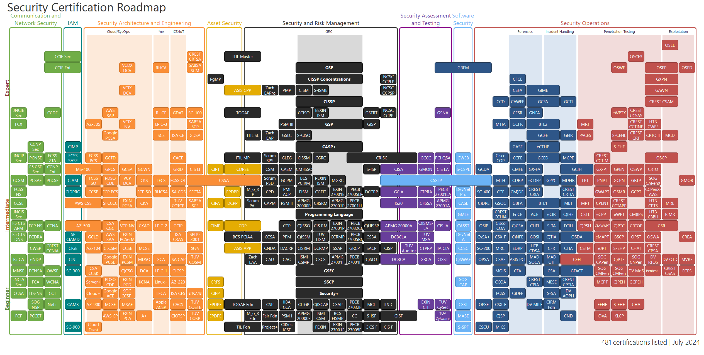
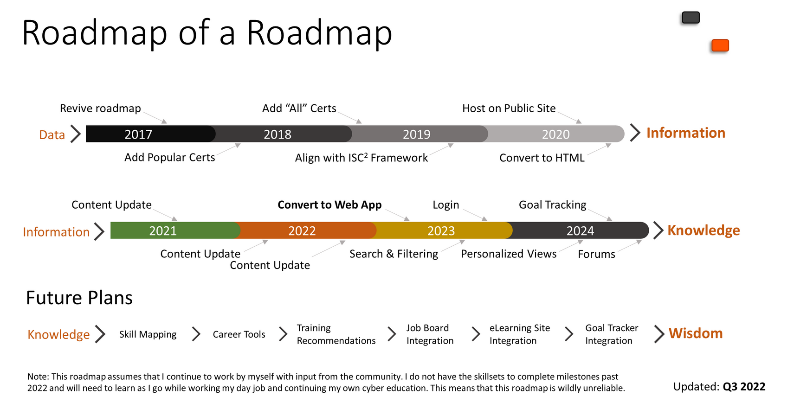
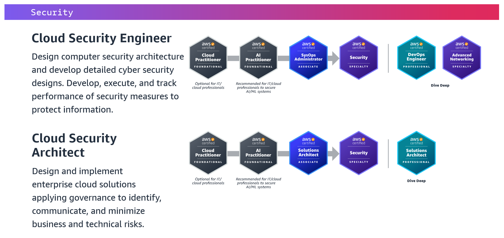

# Certifications  

## Security Certifications  

Security Certification Roadmap  
[https://pauljerimy.com/security-certification-roadmap/](https://pauljerimy.com/security-certification-roadmap/)  

  

  

## CompTIA  
[https://www.comptia.org/certifications](https://www.comptia.org/certifications)  

### Core Certifications  

CompTIA Security+  
[https://www.comptia.org/certifications/security](https://www.comptia.org/certifications/security)  

CompTIA A+  
[https://www.comptia.org/certifications/a](https://www.comptia.org/certifications/a)  

CompTIA Network+  
[https://www.comptia.org/certifications/network](https://www.comptia.org/certifications/network)  

### SANS  

Foundational  

GFACT - GIAC Foundational Cybersecurity Technologies  
[https://www.sans.org/cyber-security-courses/foundations/](https://www.sans.org/cyber-security-courses/foundations/)  
[https://www.giac.org/certifications/foundational-cybersecurity-technologies-gfact/](https://www.giac.org/certifications/foundational-cybersecurity-technologies-gfact/)  
`SANS Foundations is the most comprehensive, certified introductory cybersecurity course on the market. Developed by leading subject matter experts, SEC275 builds fundamental cybersecurity knowledge and skills, giving students with no prior technical or industry experience a level of proficiency that allows them to speak the same language as professionals. Learn foundational computer and security concepts, and develop programming skills, in an interactive learning environment, supported by world-renowned instructors, video lectures, hands-on labs and exercises. SANS Foundations transforms learning into real-world, practical skills, going far beyond what all other foundational cybersecurity courses offer.`  

## OffSec  

### Web Application Security  

OSWA - WEB-200: Foundational Web Application Assessments with Kali Linux  
[https://www.offsec.com/courses/web-200/](https://www.offsec.com/courses/web-200/)  
`OffSec’s Foundational Web Application Assessments with Kali Linux (WEB-200) course introduces web application security testing methodology, tools, and techniques in a hands-on, self-paced environment. Learners gain a deep understanding of common web vulnerabilities and how to exploit them responsibly.`  

OSWE - WEB-300: Advanced Web Attacks and Exploitation  
[https://www.offsec.com/courses/web-300/](https://www.offsec.com/courses/web-300/)  
`OffSec’s Advanced Web Attacks and Exploitation (WEB-300) course dives deep into the latest web application penetration testing methodologies and techniques. Learners gain extensive hands-on experience in a self-paced environment, designed to elevate their skills in ethical hacking, vulnerability discovery, and exploit development.`  

### APISec  

ASCP - API Security Certified Professional  
[https://www.apisecuniversity.com/certifications](https://www.apisecuniversity.com/certifications)  
`Prove your API hacking skills by taking this hands-on exam. You will have to perform a penetration test of two API-driven applications by discovering vulnerabilities, exploiting weaknesses, and reporting your findings.`  

### HackTheBox (HTB)  

HTB Certified Penetration Testing Specialist  
[https://academy.hackthebox.com/preview/certifications/htb-certified-penetration-testing-specialist](https://academy.hackthebox.com/preview/certifications/htb-certified-penetration-testing-specialist)  
`HTB Certified Penetration Testing Specialist (HTB CPTS) is a highly hands-on certification that assesses the candidates’ penetration testing skills. HTB Certified Penetration Testing Specialist certification holders will possess technical competency in the ethical hacking and penetration testing domains at an intermediate level. They will also be able to assess the risk at which an infrastructure is exposed and compose a commercial-grade as well as actionable report.`  

HTB certified Bug Bounty Hunter  
[https://academy.hackthebox.com/preview/certifications/htb-certified-bug-bounty-hunter](https://academy.hackthebox.com/preview/certifications/htb-certified-bug-bounty-hunter)  
`HTB Certified Bug Bounty Hunter (HTB CBBH) is a highly hands-on certification that assesses the candidates’ bug bounty hunting and web application pentesting skills. HTB Certified Bug Bounty Hunter certification holders will possess technical competency in the bug bounty hunting and web application penetration testing domains at an intermediate level. They will be able to spot security issues and identify avenues of exploitation that may not be immediately apparent from searching for CVEs or known exploit PoCs. They can also think outside the box, chain multiple vulnerabilities to showcase maximum impact, and actionably help developers remediate vulnerabilities through commercial-grade bug reports.`  

### PortSwigger  

Burp Suite Certified Practitioner  
[https://portswigger.net/web-security/certification](https://portswigger.net/web-security/certification)  
`The Burp Suite Certified Practitioner (BSCP) is an official certification for web security professionals, from the makers of Burp Suite. Becoming a Burp Suite Certified Practitioner demonstrates a deep knowledge of web security vulnerabilities, the correct mindset to exploit them, and of course, the Burp Suite skills needed to carry this out.`  

### TCM Security  

PNPT - Practical Network Penetration Tester  
[https://certifications.tcm-sec.com/pnpt/](https://certifications.tcm-sec.com/pnpt/)  
`The Practical Network Penetration Tester™ (PNPT) certification is an intermediate-level penetration testing exam experience. This exam will assess a student’s ability to perform a network penetration test at an professional level. Students will have five (5) full days to complete the assessment and an additional two (2) days to write a professional report.`  

PJWT - Practical Junior Web Tester  
[https://certifications.tcm-sec.com/pjwt/](https://certifications.tcm-sec.com/pjwt/)  
`The Practical Junior Web Tester™ (PJWT) certification is a beginner-level web application penetration testing exam experience. The exam will assess a student’s ability to perform a web application penetration test at an associate level. Students will have two (2) full days to complete the assessment and an additional two (2) days to write a professional report.`  

PWPT - Practical Web Penetration Tester  
[https://certifications.tcm-sec.com/pwpt/](https://certifications.tcm-sec.com/pwpt/)  
`The Practical Web Penetration Tester™ (PWPT) certification is an intermediate-level penetration testing exam experience. This exam will assess a student’s ability to perform a web application penetration test by requiring them to exploit more advanced vulnerabilities including NoSQL, race conditions, mass assignment, SSRF, template injection, and more. Students will have three (3) full days to complete the assessment and an additional two (2) days to write a professional report.`  

### Amazon Web Services (AWS)  

AWS Certified Cloud Practictioner  
[https://aws.amazon.com/certification/certified-cloud-practitioner](https://aws.amazon.com/certification/certified-cloud-practitioner)  

AWS Certified AI Practitioner  
[https://aws.amazon.com/certification/certified-ai-practitioner/](https://aws.amazon.com/certification/certified-ai-practitioner/)

AWS Solutions Architect - Associate  
[https://aws.amazon.com/certification/certified-solutions-architect-associate/](https://aws.amazon.com/certification/certified-solutions-architect-associate/)  

AWS Certified Security - Specialty  
[https://aws.amazon.com/certification/certified-security-specialty/](https://aws.amazon.com/certification/certified-security-specialty/)  
`AWS Certified Security - Specialty validates your expertise in creating and implementing security solutions in the AWS Cloud. This certification also validates your understanding of specialized data classifications and AWS data protection mechanisms; data-encryption methods and AWS mechanisms to implement them; and secure internet protocols and AWS mechanisms to implement them.`  

AWS Certified Solutions Architect - Professional  
[https://aws.amazon.com/certification/certified-solutions-architect-professional/](https://aws.amazon.com/certification/certified-solutions-architect-professional/)  

  
[Image Source](https://d1.awsstatic.com/training-and-certification/docs/AWS_certification_paths.pdf?pp=cert&c=exam&z=6)  
